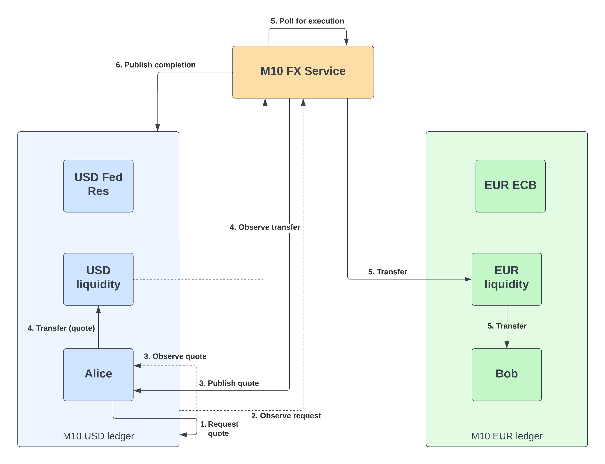

# M10 FX remittance

This project provides a sample implementation of a delayed FX remittance programmable payment on the [M10 Ledger](https://m10.io/).
It uses the [M10 SDK](..) to set up a set of users, accounts & roles to support the exchange of tokens of 
currency `A` to be swapped for tokens of currency `B` when certain conditions are met,
i.e. the exchange rate reaches an upper or lower limit, or the validity period for the swap has been reached. This allows users
to optimize for a more opportune FX rate instead of settling for the current market rate.

More information about the M10 platform can be found in the [docs](https://develop.m10.net/docs/).

The program provides a programmable payment (~ smart contract), a.k.a a `service` & a `cli` tool to interact with the FX program.
Liquidity is provided as a static exchange rate for demo purposes, but can be provided by an external exchange rate API, e.g. [Exchange Rates](https://exchangeratesapi.io/).




## Pre-requisites

* Install the required platform dependencies:
    * `sudo apt-get install libssl-dev libudev-dev pkg-config zlib1g-dev llvm clang cmake make libprotobuf-dev protobuf-compiler`
* Install the [Rust toolchain](https://www.rust-lang.org/tools/install)
    * e.g. `curl --proto '=https' --tlsv1.2 -sSf https://sh.rustup.rs | sh`
* Note: optionally a Dockerfile is provided for a ready to build and use development environment (give it plenty of resources!)
  * `docker build . --tag m10fx:latest -f ./Dockerfile`
  * `docker run --name m10fx --rm -it -v "$(pwd)":/m10fx m10fx`
  * `/> cd m10fx && cargo build --all-targets --release`

## Build & Deploy

### CLI

use the `cargo` tool to build the `cli`:

```shell
cargo build --release --bin cli
```
or run it directly using `cargo run`, e.g.

```shell
cargo run --release --bin cli
```

### Service

The `service` can be built using the `cargo` toolchain, e.g.

```shell
cargo build --release --bin service
```

or run it directly using `cargo run`, e.g.

```shell
cargo run --release --bin service
```

In order to run the service, a configuration of liquidity accounts & key pairs for each currency need to be provided.
See `Setup` below on to generate a configuration file (~ `config.toml`).

## Setup

We'll need to set up a few identities before we interact with the program using the `cli`. 

```shell
cargo run --release --bin cli -- --url https://develop.m10.net  setup -c eur -c usd -c btc
```

Using the `setup` command & an M10 ledger deployment, e.g. `develop.m10.net`, we will create a set of liquidity providers
for a list of currencies, e.g. `EUR`, `USD` & `BTC`. In order to execute this setup a key pair needs to be provided with
the ability to create accounts & create roles & role-bindings. The default key pair provided will have authorization on all
M10 test deployments.

```shell
cargo run --bin cli -- -u https://develop.m10.net  setup -c eur -c usd -c btc
INFO Setup { key_pair: None, currencies: ["eur", "usd", "btc"] }
INFO setup: Found account account_id=00000000000000000000000000000000 currency=USD
INFO setup: Found account account_id=04000000000000000000000000000000 currency=EUR
INFO setup: Found account account_id=05000000000000000000000000000000 currency=BTC
INFO setup:account{currency=USD}:liquidity: Created account account_id=00000000004900000000000000000001
INFO setup:account{currency=USD}:liquidity: Registering RBAC document
INFO setup:account{currency=USD}:liquidity: Created role & role-binding role_id=9b3df815-6fe0-48b9-887e-8cda6c39ed08
INFO setup:account{currency=USD}:liquidity: Funding account funding=10000000
INFO setup:account{currency=USD}:Alice: Created account account_id=00000000004a00000000000000000001
INFO setup:account{currency=USD}:Alice: Registering RBAC document
INFO setup:account{currency=USD}:Alice: Created role & role-binding role_id=c3fd8e2a-fc8a-4a3e-85a5-bee777ad5b48
INFO setup:account{currency=USD}:Alice: Funding account funding=10000000
INFO setup:account{currency=USD}: Created Alice USD account account_id=00000000004a00000000000000000001
INFO setup:account{currency=EUR}:liquidity: Created account account_id=04000000003100000000000000000001
INFO setup:account{currency=EUR}:liquidity: Registering RBAC document
INFO setup:account{currency=EUR}:liquidity: Created role & role-binding role_id=73aba9b2-b3e5-4b62-972a-f70c1b71622c
INFO setup:account{currency=EUR}:liquidity: Funding account funding=10000000
INFO setup:account{currency=EUR}:Bob: Created account account_id=04000000003200000000000000000001
INFO setup:account{currency=EUR}:Bob: Registering RBAC document
INFO setup:account{currency=EUR}:Bob: Created role & role-binding role_id=503f19e1-fdf1-48ea-ab1d-1ad5036109a6
INFO setup:account{currency=EUR}: Created Bob EUR account account_id=04000000003200000000000000000001
INFO setup:account{currency=BTC}:liquidity: Created account account_id=05000000001200000000000000000001
INFO setup:account{currency=BTC}:liquidity: Registering RBAC document
INFO setup:account{currency=BTC}:liquidity: Created role & role-binding role_id=cafa2e74-04f6-4ab9-a1de-0ab72a67665c
INFO setup:account{currency=BTC}:liquidity: Funding account funding=10000000
INFO setup: Created role & role-binding role_id=1c87f010-7c68-40ed-a1f6-e90346492c1e
INFO setup: Wrote config to path=config.toml
```

This sets up a liquidity account for each provided currency (given an instrument is available on the ledger), e.g.
```shell
INFO setup:account{currency=USD}:liquidity: Created account account_id=00000000004900000000000000000001
INFO setup:account{currency=USD}:liquidity: Registering RBAC document
INFO setup:account{currency=USD}:liquidity: Created role & role-binding role_id=9b3df815-6fe0-48b9-887e-8cda6c39ed08
INFO setup:account{currency=USD}:liquidity: Funding account funding=10000000
```
With the newly created account ID, role & role-binding ID displayed on screen.
In addition, each liquidity provider will be pre-funded to allow transfers.
A single key pair is generated for all the liquidity accounts: `liquidity.pkcs8`.
The liquidity configuration for the `service` is written to a `config.toml` file, e.g.

```toml
address = "https://develop.m10.net"

[liquidity.USD]
account = "00000000004900000000000000000001"
base_rate = "1"
key_pair = "./liquidity.pkcs8"

[liquidity.EUR]
account = "04000000003100000000000000000001"
base_rate = "0.9"
key_pair = "./liquidity.pkcs8"

[liquidity.BTC]
account = "05000000001200000000000000000001"
base_rate = "0.000043"
key_pair = "./liquidity.pkcs8"
```

## Deploying the service

The above configuration file is read by the `service` during startup & provides instructions on which FX swaps to support.
The `service` is responsible for observing quote requests & publishing the relevant quotes to the requesting users.
It will also observe any transfers related to a previously published quote & ensure the proposed swap is handled with 
the user provided parameters.

## Quoting FX swaps

The `setup` command also creates two user accounts, `Alice` & `Bob` for the first & second currency provisioned:

```shell
INFO setup:account{currency=USD}: Created Alice USD account account_id=00000000004a00000000000000000001
INFO setup:account{currency=EUR}: Created Bob EUR account account_id=04000000003200000000000000000001
```

These can be used as clients for the FX program. Their keys will be stored as `alice.pkcs8` & `bob.pkcs8` respectively.

Using the `cli` one of these users can interact with the fx program. In order for `Alice` to `initiate` the contract, she'll need to
invoke the following command:

```shell
cargo run --bin cli initiate --amount 1000 --from 00000000004a00000000000000000001  --to 04000000003200000000000000000001  --key-pair ./alice.pkcs8
```

This requests a quote for an FX swap of `10.00 USD` from `Alice`'s account to the equivalent in `EUR` for `Bob`, e.g.

```shell
cargo run --bin cli initiate -a 1000 -f 00000000004a00000000000000000001 -t 04000000003200000000000000000001 -k ./alice.pkcs8
INFO Initiate { key_pair: "./alice.pkcs8", from: "00000000004a00000000000000000001", to: "04000000003200000000000000000001", amount: 1000 }
INFO initiate: Submitted transaction tx_id=5996250000 context_id=713f6414ca45d04f
INFO initiate: Waiting for the proposed quote
INFO initiate: Received quote Quote {
    request: Request {
        from: [4; 52],
        to: [0; 76],
        amount: 10.00,
    },
    rate: 0.9,
    intermediary: [4; 51],
}
INFO initiate: context_id=713f6414ca45d04f
```

The returned quote indicates a quote for `1 USD -> 0.9 EUR` & will be performed using `04000000003300000000000000000001 (=[4; 51])` as a liquidity provider for USD.
The quote is attached to a ledger context ID `713f6414ca45d04f`. This allows multiple independent transactions on the M10 ledger to be tied together.

## Executing FX swaps

An FX swap can be executed using the `execute` command of the `cli`, e.g.

```shell
cargo run --bin cli -- execute --key-pair ./alice.pkcs8 --margin 0.10 --valid-for 300 --context-id 713f6414ca45d04f
```

This executes a previous quote identified by the `context-id` parameter as returned at the end of the `initiate` 
command, e.g. `713f6414ca45d04f`. In addition, a user can specify the `margin`, which determines the upper & lower limits
for the FX rate. If it exceeds either of these limits, it will execute immediately at the current rate. 
Finally, a validity period can be specified using the `valid-for` parameter, determining a final settlement date in seconds from now.

```shell
cargo run --bin cli -- execute -k ./alice.pkcs8 --margin 0.10 -v 5 -c 713f6414ca45d04f 
INFO ExecuteQuote { key_pair: "./alice.pkcs8", context_id: "713f6414ca45d04f", margin: 0.10, valid_for: Some(300) }
INFO execute: Transferring from [4; 52] -> [4; 51]
INFO execute: Transfer success txId=6003570000
INFO Waiting for swap confirmation
...
INFO Swap completed
```

In case of a longer duration contract, the `execute` command will continue polling every 15 seconds until the program has completed.

## References

* [M10 Docs](https://develop.m10.net/docs/)
* [M10 Platform](https://m10.io)
* [Programmable Money and Programmable Payments](https://jonasgross.medium.com/programmable-money-and-programmable-payments-c0f06bbcd569)
